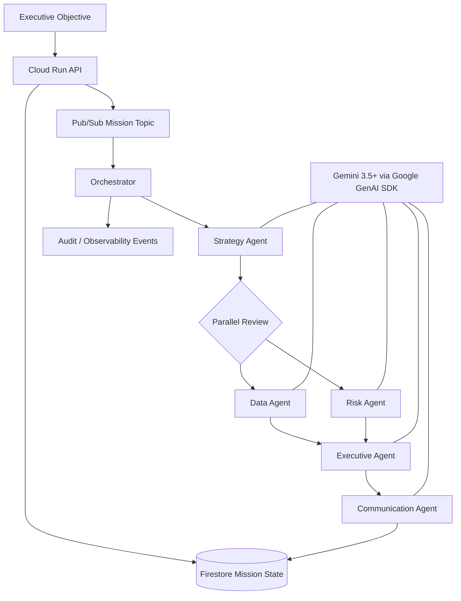

# NEXUS Architecture

## Agent fleet

| Agent | Job | Primary control |
|---|---|---|
| Strategy | Decompose objective | explicit assumptions + decision gates |
| Data | Test evidence and constraints | uncertainty disclosure |
| Risk | Challenge the plan | early-warning signals + mitigations |
| Executive | Reconcile into decision | confidence + escalation rules |
| Communication | Issue concise brief | factual compression |

## Async pattern

For local demos, the API dispatches the mission as an in-process task. For Google Cloud deployment,
`USE_PUBSUB=true` changes dispatch to Pub/Sub. A push subscription calls `/internal/pubsub/process`,
which executes the mission independently of the original user request.

## Persistence

`USE_FIRESTORE=true` persists mission state, outputs, and audit events across requests and restarts.
The memory adapter remains available for zero-setup local evaluation.

## Governance

NEXUS exposes a minimal agent registry with purpose and permissions. Every material state transition adds
an audit event. The design intentionally separates mission input, specialist analysis, executive synthesis,
and outward communication so each step can be inspected.
